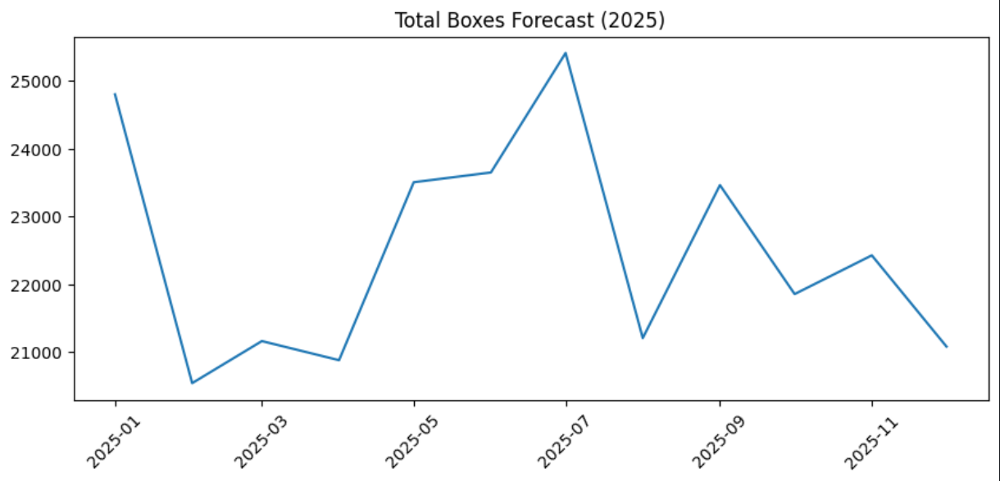

# Chocolate Sales Forecasting (2022–2025) 🍫📈

<p align="center">
  
</p>

Forecast monthly chocolate sales using historical transactions.  
This project builds and evaluates forecasting models using a time-aware workflow, then generates **2025 forecasts** for :
- **Total Revenue** (`total_revenue`)
- **Total Boxes Shipped** (`total_boxes`)

The final models are trained on **2022–2023** data and tested on **2024**. After validation, the project produces **month-by-month forecasts for 2025**.

---

## 📑 Table of Contents

- [🎯 Project Goal](#-project-goal)
- [📊 Dataset](#-dataset)
- [Methodology](#methodology)
  - [EDA & Cleaning](#1-eda--cleaning)
  - [Feature Engineering for Forecasting](#2-feature-engineering-for-forecasting)
  - [Modeling & Evaluation](#3-modeling--evaluation)
  - [2025 Forecast Generation](#4-2025-forecast-generation)
- [Metrics](#metrics)
- [Results (2024 Test Set)](#results-2024-test-set)
  - [2025 Revenue Forecast](#-2025-revenue-forecast)
  - [2025 Boxes Forecast](#-2025-boxes-forecast)
- [Repository Structure](#-repository-structure)
- [How to Run](#how-to-run)
  - [Install dependencies](#1--install-dependencies)
  - [Execute notebooks in order](#2--execute-notebooks-in-order)

---

## 🎯 Project Goal

**Problem statement :**  
How can we use historical chocolate sales data to predict future demand (revenue and volume) to support better planning and reduce stockouts/overstock?

**Targets :**
- Monthly **total revenue**
- Monthly **total boxes shipped**

**Forecast horizon :**
- Full year **2025** (12 months)

---

## 📊 Dataset

- Source : [Kaggle Chocolate Sales dataset](https://www.kaggle.com/datasets/saidaminsaidaxmadov/chocolate-sales).  

- Key columns used :
   - `Date`
   - `Country`
   - `Amount` (revenue)
   - `Boxes Shipped` (volume)

The pipeline aggregates transactions into monthly totals per country and engineers lag-based features for forecasting.

---

## Methodology

### 1) EDA & Cleaning
- Parse dates into datetime
- Convert `Amount` from currency format to numeric
- Create derived metric `Amount_per_box`
- Explore trends/seasonality and country/product contributions

### 2) Feature Engineering for Forecasting
To use scikit-learn for forecasting, time series data is transformed into a supervised learning table with :
- Lag features: `rev_lag_1`, `rev_lag_2`, `box_lag_1`, `box_lag_2`
- Seasonality features: `month_num`, `month_sin`, `month_cos`
- Categorical encoding: One-hot encoding for `country`

### 3) Modeling & Evaluation
**Time-based split :**
- Train: 2022–2023
- Test: 2024

**Models compared :**
- Naive baseline (lag-1)
- Ridge regression (with seasonality)
- HistGradientBoostingRegressor (final choice)

### 4) 2025 Forecast Generation
Forecasts are generated **recursively month-by-month** for 2025:
- Each month prediction becomes part of the history to compute next month lags.

---

## Metrics

- **RMSE** (Root Mean Squared Error)

$$
\mathrm{RMSE}=\sqrt{\frac{1}{n}\sum_{i=1}^{n}\left(y_i-\hat{y}_i\right)^2}
$$

- **MAPE** (Mean Absolute Percentage Error)

$$
\mathrm{MAPE}=\frac{1}{n}\sum_{i=1}^{n}\left|\frac{y_i-\hat{y}_i}{y_i}\right| \times 100
$$

Where:
- $y_i$ is the true value, $\hat{y}_i$ is the predicted value, and $n$ is the number of observations.

---

## Results (2024 Test Set)

Final selected model: **HistGradientBoostingRegressor**

- **Revenue forecast MAPE:** ~14.38%
- **Boxes forecast MAPE:** ~14.89%

### 💰 2025 Revenue Forecast


### 📦 2025 Boxes Forecast


- The final HistGradientBoosting models achieved **~14% MAPE on 2024 data** and were used to generate 2025 forecasts.

---

## 🗂️ Repository Structure

```text
.
├── data/
│   ├── chocolate_sales.csv        # raw dataset (local)
│   ├── processed_data.csv         # cleaned dataset (from EDA)
│   └── monthly_data.csv           # monthly aggregated modeling table
│
├── models/
│   ├── hgb_revenue.joblib         # final model for revenue
│   ├── hgb_boxes.joblib           # final model for boxes
│   └── features.json              # exact feature list/order used in training
│
├── notebooks/
│   ├── 01_eda.ipynb               # cleaning + exploration
│   ├── 02_modeling.ipynb          # feature engineering + training + evaluation
│   └── 03_forecast_2025.ipynb     # load models + generate 2025 forecasts
│
├── outputs/
│   └── forecast_2025.csv          # final predictions for 2025
│
├── README.md
└── requirements.txt
```

---

### How to Run

### 1) 📥 Install dependencies

```bash
pip install -r requirements.txt
```

### 2) ▶️ Execute notebooks in order

1. `notebooks/01_eda.ipynb`  
   - **Outputs:** `data/processed_data.csv`

2. `notebooks/02_modeling.ipynb`  
   - **Outputs:**
     - `data/monthly_data.csv`
     - `models/hgb_revenue.joblib`
     - `models/hgb_boxes.joblib`
     - `models/features.json`

3. `notebooks/03_forecast_2025.ipynb`  
   - **Outputs:** `outputs/forecast_2025.csv`
  
[⬆️ Back to top](#-table-of-contents)
